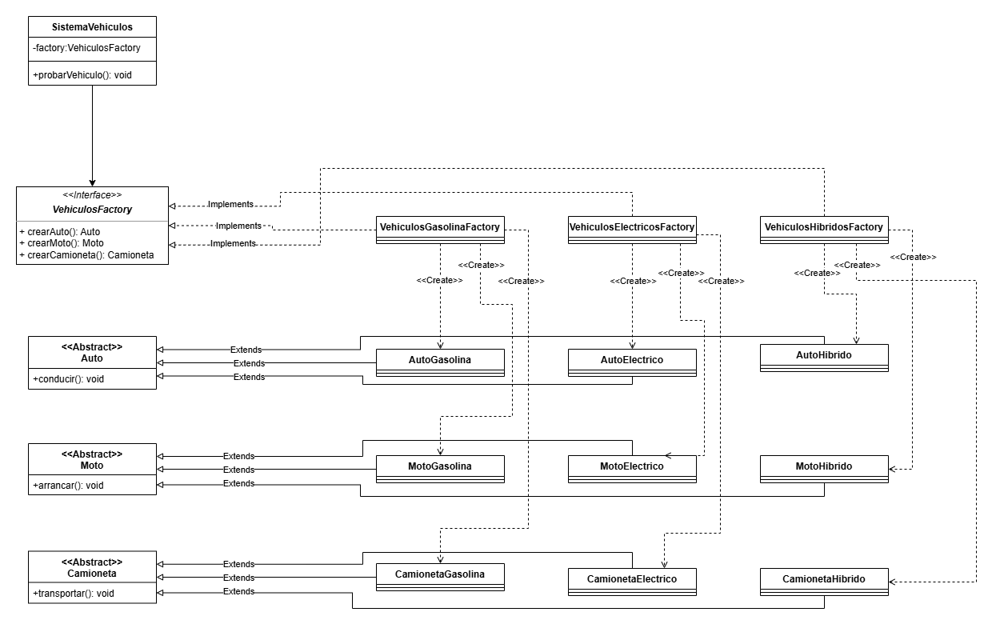

# Ejercicio 04: Sistema de vehiculos por tipo de energia
## Historia de usuario

Una empresa automotriz quiere crear un sistema que permita fabricar vehículos según el tipo de energía que utilizan.

El sistema debe soportar tres familias de vehículos:

    Vehículos eléctricos
    Vehículos a gasolina
    Vehículos híbridos

Cada familia debe tener sus propios productos relacionados:

    Auto
    Moto
    Camioneta

La idea es que si se elige la fábrica de vehículos eléctricos, todo lo creado pertenezca a esa familia:

    Auto eléctrico
    Moto eléctrica
    Camioneta eléctrica

Y no se mezclen familias como:

    Auto eléctrico
    Moto a gasolina
    Camioneta híbrida
## Objetivo del ejercicio

Aplicar Abstract Factory para crear familias completas de vehículos según su tipo de energía.

## Productos abstractos

Debes crear interfaces o clases abstractas para:

    Auto
    Moto
    Camioneta

Pero esta vez cada producto tendrá métodos más específicos.

Por ejemplo:

    Auto -> conducir()
    Moto -> arrancar()
    Camioneta -> transportar()
## Productos concretos
### Familia eléctrica
    AutoElectrico
    MotoElectrica
    CamionetaElectrica
### Familia gasolina
    AutoGasolina
    MotoGasolina
    CamionetaGasolina
### Familia híbrida
    AutoHibrido
    MotoHibrida
    CamionetaHibrida
## Fábrica abstracta

Debes crear una fábrica abstracta llamada, por ejemplo:

    VehiculoFactory

Debe tener métodos como:

    crearAuto()
    crearMoto()
    crearCamioneta()

Cada método debe devolver el tipo abstracto correspondiente:

    Auto crearAuto();
    Moto crearMoto();
    Camioneta crearCamioneta();
## Fábricas concretas

Debes tener tres fábricas concretas:

    VehiculoElectricoFactory
    VehiculoGasolinaFactory
    VehiculoHibridoFactory

Cada fábrica debe crear solo vehículos de su propia familia.

Por ejemplo:

    VehiculoElectricoFactory
    ├── crea AutoElectrico
    ├── crea MotoElectrica
    └── crea CamionetaElectrica
## Cliente

Debes crear una clase cliente, por ejemplo:

    ClienteVehiculo

o:

    SistemaVehiculos

Esta clase debe recibir una VehiculoFactory.

El cliente debe poder usar cualquier familia sin conocer las clases concretas.

Por ejemplo:

    public void probarVehiculos() {
    auto.conducir();
    moto.arrancar();
    camioneta.transportar();
    }
## Mayor dificultad respecto al ejercicio 3

En este ejercicio quiero que agregues atributos simples a los productos concretos.

Por ejemplo, cada vehículo puede tener:

    modelo
    tipoEnergia
    velocidadMaxima

No es necesario hacer algo complejo. Puede ser algo así:
    
    private String modelo;
    private String tipoEnergia;
    private int velocidadMaxima;

Y luego mostrarlos con System.out.println().

Ejemplo de salida esperada

Si usas la fábrica eléctrica:

    ===== VEHÍCULOS ELÉCTRICOS =====
    Auto eléctrico Tesla Model 3 conduciendo con energía eléctrica.
    Moto eléctrica NIU arrancando de forma silenciosa.
    Camioneta eléctrica Rivian transportando carga sin emisiones.

Si usas gasolina:

    ===== VEHÍCULOS A GASOLINA =====
    Auto a gasolina Toyota Corolla conduciendo con motor de combustión.
    Moto a gasolina Yamaha arrancando con motor tradicional.
    Camioneta a gasolina Ford transportando carga pesada.

## Diagrama de Clases
