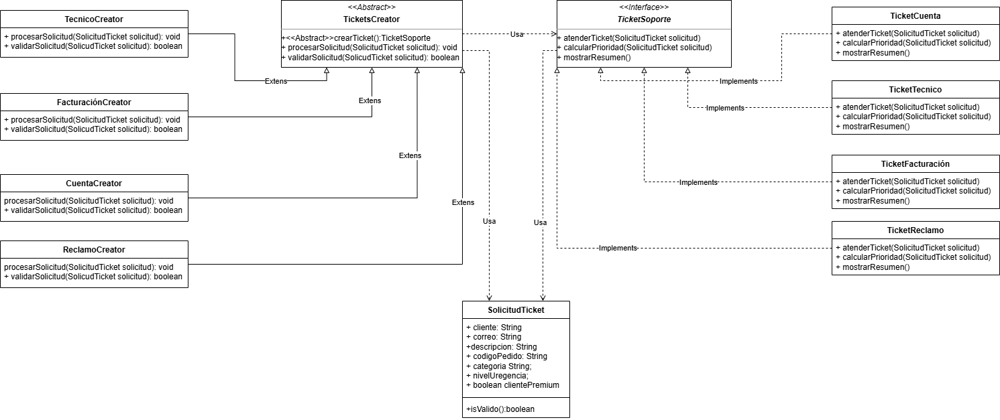

# Ejercicio 06: Sistema de atención de tickets de soporte

## Historia de usuario
Como usuario de una plataforma digital, quiero registrar tickets de soporte según el tipo de problema
que tengo, para que el sistema pueda atenderlos con el flujo correcto.

El sistema debe permitir registrar tickets de:

    Soporte técnico
    Soporte de facturación
    Soporte de cuenta
    Soporte de reclamo

Cada tipo de ticket debe procesarse de manera diferente.

## Solicitud del cliente

Necesito un sistema que permita atender distintos tipos de tickets. Actualmente tenemos tickets 
técnicos, de facturación, de cuenta y de reclamo, pero en el futuro podríamos agregar 
nuevos tipos como soporte legal, soporte de seguridad o soporte premium.

No quiero que el Main cree directamente las clases concretas de 
soporte. Cada tipo de ticket debe tener su propio creador.

## Clases que debes crear
### Producto abstracto
    TicketSoporte

Puede ser una interfaz.

Debe tener métodos como:

    atenderTicket(SolicitudTicket solicitud)
    calcularPrioridad(SolicitudTicket solicitud)
    mostrarResumen()
### Productos concretos
    TicketTecnico
    TicketFacturacion
    TicketCuenta
    TicketReclamo

Cada uno debe implementar TicketSoporte.

### Creador abstracto
    TicketCreator

Debe tener algo como:

    crearTicket()
    procesarSolicitud(SolicitudTicket solicitud)
    validarSolicitud(SolicitudTicket solicitud)
### Creadores concretos
    TecnicoCreator
    FacturacionCreator
    CuentaCreator
    ReclamoCreator

Cada uno debe crear su ticket correspondiente.

### Modelo obligatorio

Crea una clase:

    SolicitudTicket

Con estos atributos mínimos:

    String cliente;
    String correo;
    String descripcion;
    String codigoPedido;
    String categoria;
    int nivelUrgencia;
    boolean clientePremium;

## Validaciones generales

Estas validaciones deben aplicarse a todos los tickets:

    El cliente no debe estar vacío.
    El correo no debe estar vacío.
    El correo debe contener @.
    La descripción debe tener al menos 10 caracteres.
    El nivel de urgencia debe estar entre 1 y 5.

Puedes colocarlas en SolicitudTicket con un método como:

    esValida()

Y luego llamarlo desde el TicketCreator.

## Validaciones especiales

Aquí está la dificultad principal.

### Ticket técnico

Debe validar que:

    La categoría sea "tecnico" o "sistema".
### Ticket de facturación

Debe validar que:

    El código de pedido no esté vacío.
    El código de pedido empiece con "PED-".
### Ticket de cuenta

Debe validar que:

    La categoría sea "cuenta", "login" o "seguridad".
### Ticket de reclamo

Debe validar que:

    El nivel de urgencia sea mayor o igual a 3.
    La descripción tenga al menos 20 caracteres.

## Dificultad extra obligatoria

Agrega un pequeño menú en consola.

El usuario debe poder elegir:

    1. Registrar ticket técnico
    2. Registrar ticket de facturación
    3. Registrar ticket de cuenta
    4. Registrar ticket de reclamo
    5. Salir

Según la opción, el sistema debe usar el Creator correspondiente.

No necesitas guardar en base de datos. Puedes guardar los tickets procesados en una 
lista si quieres practicar más.

## Reto final

Agrega un nuevo tipo de ticket:

    TicketSoportePremium

Reglas especiales:

    Solo se permite si clientePremium es true.
    El nivel de urgencia debe ser mayor o igual a 4.

Y debes agregar solamente:

    TicketPremium
    PremiumCreator

La idea es que no tengas que modificar TicketCreator, ni TicketSoporte, ni las clases
ya existentes.

## Diagrama de clases
