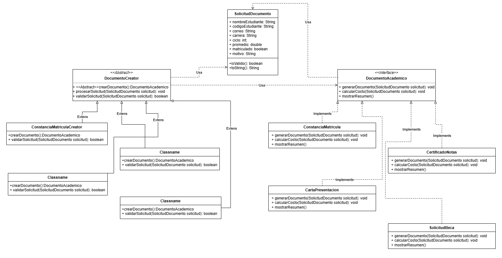

# EXAMEN FACTORY
## Indicaciones

No uses respuestas copiadas de los ejercicios anteriores. Puedes guiarte por la estructura, pero el caso debe estar adaptado al nuevo problema.

Debes entregar:

    1. Diagrama de clases UML
    2. Código Java organizado por paquetes
    3. Main de prueba
    4. Explicación breve del patrón aplicado
    5. Captura o salida de consola
## Caso: Sistema de generación de documentos académicos

Una universidad necesita un sistema para generar diferentes tipos de documentos académicos para sus estudiantes.

El sistema debe permitir generar:

    Constancia de matrícula
    Certificado de notas
    Carta de presentación
    Solicitud de beca

Cada documento tiene una forma distinta de generarse, validar datos y mostrar información.

La universidad quiere que en el futuro se puedan agregar nuevos documentos, como:

    Constancia de egresado
    Certificado de prácticas
    Carta de recomendación

sin modificar el código principal del sistema.

## Parte 1: Modelo de datos

Debes crear una clase modelo llamada:

    SolicitudDocumento

Con los siguientes atributos mínimos:

    String nombreEstudiante;
    String codigoEstudiante;
    String correo;
    String carrera;
    int ciclo;
    double promedio;
    boolean matriculado;
    String motivo;
### Validaciones generales

Toda solicitud debe cumplir:

    El nombre del estudiante no debe estar vacío.
    El código del estudiante no debe estar vacío.
    El correo debe contener @.
    La carrera no debe estar vacía.
    El ciclo debe ser mayor a 0.
    El motivo debe tener al menos 10 caracteres.

Puedes colocar estas validaciones en el modelo con un método como:

    public boolean esValida()
## Parte 2: Producto abstracto

Crea una interfaz llamada:

    DocumentoAcademico

Debe tener métodos como:

    generarDocumento(SolicitudDocumento solicitud)
    calcularCosto(SolicitudDocumento solicitud)
    mostrarResumen()

Cada documento debe implementar esos métodos.

## Parte 3: Productos concretos

Debes crear estas clases:

    ConstanciaMatricula
    CertificadoNotas
    CartaPresentacion
    SolicitudBeca

Cada clase debe implementar DocumentoAcademico.

## Parte 4: Creator abstracto

Crea una clase abstracta:

    DocumentoCreator

Debe tener:

    crearDocumento()
    procesarSolicitud(SolicitudDocumento solicitud)
    validarSolicitud(SolicitudDocumento solicitud)

El método procesarSolicitud() debe seguir este flujo:

    1. Validar la solicitud.
    2. Crear el documento usando Factory Method.
    3. Generar el documento.
    4. Calcular el costo.
    5. Mostrar el resumen.

El Main no debe crear documentos concretos directamente.

No hagas esto:

    DocumentoAcademico documento = new CertificadoNotas();

Debes hacer algo como:

    DocumentoCreator creator = new CertificadoNotasCreator();
    creator.procesarSolicitud(solicitud);
## Parte 5: Creators concretos

Debes crear:

    ConstanciaMatriculaCreator
    CertificadoNotasCreator
    CartaPresentacionCreator
    SolicitudBecaCreator

Cada uno debe crear su documento correspondiente.

## Parte 6: Validaciones especiales

Además de las validaciones generales, cada tipo de documento tiene reglas propias.

### Constancia de matrícula

Debe validar:

    El estudiante debe estar matriculado.
    El ciclo debe ser mayor o igual a 1.
### Certificado de notas

Debe validar:

    El promedio debe ser mayor o igual a 0.
    El promedio no puede ser mayor a 20.
### Carta de presentación

Debe validar:

    El ciclo debe ser mayor o igual a 5.
    El motivo debe contener la palabra "practicas", "trabajo" o "empresa".
### Solicitud de beca

Debe validar:

    El promedio debe ser mayor o igual a 15.
    El estudiante debe estar matriculado.
## Parte 7: Cálculo de costo

Cada documento debe calcular su costo de forma distinta.

Usa estas reglas:

### Constancia de matrícula
    Costo fijo: S/ 10
### Certificado de notas
    Costo base: S/ 20
    Si el promedio es mayor o igual a 18, descuento de S/ 5
### Carta de presentación
    Costo fijo: S/ 15
### Solicitud de beca
    Costo: S/ 0

Cada clase concreta debe guardar el costo calculado en un atributo, por ejemplo:

    private double costo;
## Parte 8: Menú en consola

Crea un menú con estas opciones:

    1. Generar constancia de matrícula
    2. Generar certificado de notas
    3. Generar carta de presentación
    4. Generar solicitud de beca
    5. Salir

Según la opción seleccionada, el sistema debe usar el Creator correspondiente.

## Parte 9: Reto final

Agrega un nuevo documento:

    ConstanciaEgresado

Reglas especiales:

    El ciclo debe ser mayor o igual a 10.
    El promedio debe ser mayor o igual a 11.

Costo:

    S/ 25

Debes agregar solamente:

    ConstanciaEgresado
    ConstanciaEgresadoCreator

No deberías modificar:

    DocumentoCreator
    DocumentoAcademico
    SolicitudDocumento
## Diagrama de Clases
